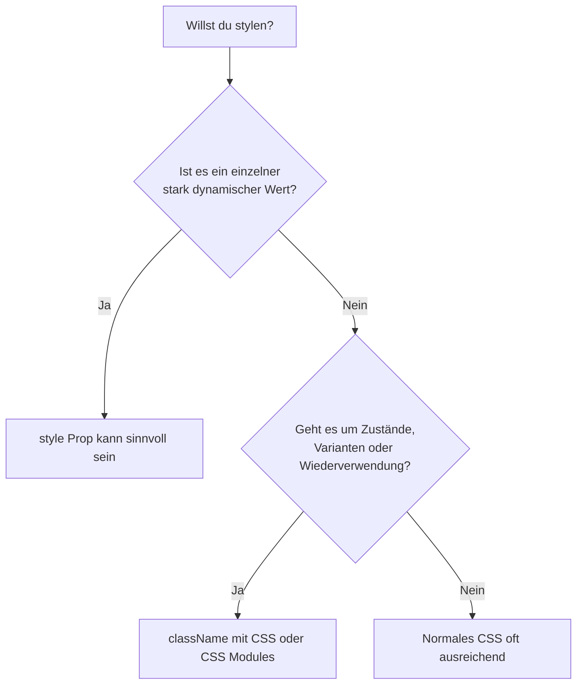
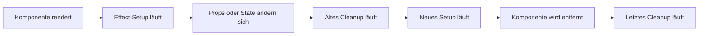
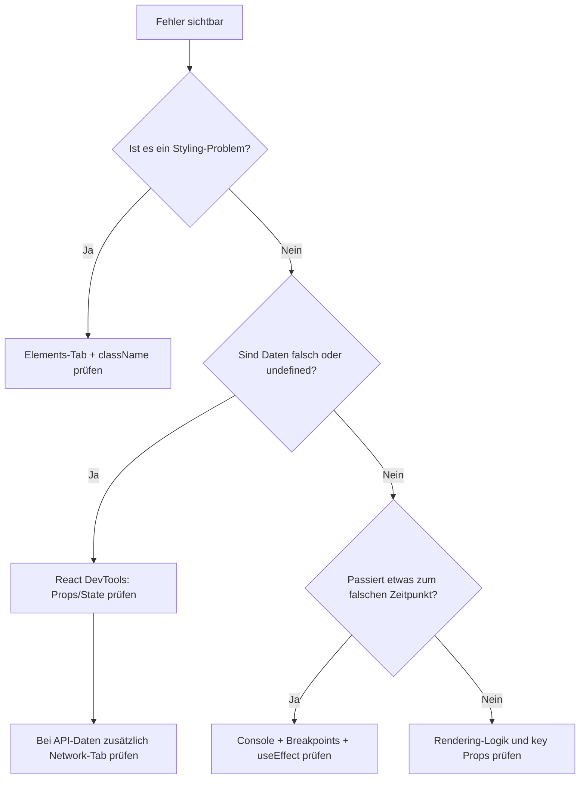

###### Themen

Styling-Methoden in React

- CSS-Dateien in React-Komponenten nutzen
- CSS Modules als strukturierte Styling-Methode
- Bedingte className-Verwendung statt Fokus auf Inline-Styles

Lifecycle und Nebenwirkungen in funktionalen Komponenten

- Was sind Seiteneffekte?
- Einfacher Einsatz von useEffect
- Cleanup bei einfachen Beispielen (z.B. Timer, Event-Listener)

Fehlersuche und Debugging

- React Developer Tools Grundlagen
- Typische Fehlerquellen bei Props, State und Rendering
- Console und Browser-DevTools sinnvoll nutzen

# 🎨 Styling-Methoden in React

In React trennst du Struktur, Verhalten und Aussehen normalerweise nicht mehr so streng nach „HTML, CSS, JavaScript“ wie in klassischen Webseiten, sondern nach **Komponenten**. Eine Komponente bringt oft ihr eigenes Markup, ihre Logik und ihr Styling mit. Genau deshalb ist es wichtig zu verstehen, **wie** man in React sauber stylt: mit normalen CSS-Dateien, mit CSS Modules und mit sinnvoll eingesetzten `className`-Bedingungen statt alles per Inline-Style zu lösen. React selbst unterstützt das Setzen von Klassen mit `className` und Styles über das `style`-Prop direkt im JSX ([Adding Styles and CSS](https://react.dev/learn/adding-styles-and-css)).

<br><br><br>
## 📄 CSS-Dateien in React-Komponenten nutzen

Die einfachste Styling-Methode ist die klassische CSS-Datei. Du legst zum Beispiel eine Datei wie `Button.css` an und importierst sie in deine Komponente. In React funktioniert das in typischen Toolchains wie Vite oder anderen Build-Setups direkt über einen Import in JavaScript oder JSX ([Adding Styles and CSS](https://react.dev/learn/adding-styles-and-css)).

```jsx
import './Button.css';

export function Button({ children }) {
  return <button className="button">{children}</button>;
}
```

```css
.button {
  background: royalblue;
  color: white;
  border: none;
  padding: 0.75rem 1rem;
  border-radius: 8px;
}
```

Wichtig ist dabei: **Der Import bedeutet nicht, dass das CSS automatisch nur für diese Komponente gilt.** Die Klassen in einer normalen CSS-Datei sind in der Regel **global**. Wenn du also irgendwo anders ebenfalls `.button` schreibst, können sich Styles gegenseitig beeinflussen. Das ist einer der häufigsten Gründe, warum Styling in größeren React-Projekten unübersichtlich wird.

Normale CSS-Dateien sind trotzdem sehr nützlich, vor allem wenn:

- du globale Basisstile brauchst,
- du ein Reset oder Theme definierst,
- du Layout-Klassen wiederverwenden willst,
- dein Projekt noch klein und überschaubar ist.

Ein typisches Muster ist daher: **globale CSS-Dateien für App-weite Regeln**, aber **komponentennahe Dateien für konkrete UI-Bausteine**.

<br><br><br>
### 🧩 Wie der Import in der Praxis zu verstehen ist

Wenn du eine CSS-Datei in eine React-Komponente importierst, dann sagst du deinem Build-System im Grunde: „Diese Styles sollen mit in das Bundle aufgenommen werden.“ Du bekommst dadurch **keine JavaScript-Variable**, sondern sorgst dafür, dass die CSS-Regeln verfügbar sind. Die Verknüpfung zur Komponente passiert dann über `className`.

React verwendet im JSX nicht `class`, sondern `className`, weil `class` in JavaScript ein reserviertes Wort ist. Deshalb schreibst du:

```jsx
<div className="card">Inhalt</div>
```

und nicht:

```jsx
<div class="card">Inhalt</div>
```

Das ist der offizielle React-Weg, CSS-Klassen an DOM-Elemente zu hängen ([Adding Styles and CSS](https://react.dev/learn/adding-styles-and-css)).

<br><br><br>
### ⚠️ Typische Probleme mit normalen CSS-Dateien

Bei klassischen CSS-Dateien tauchen in React-Projekten schnell drei Probleme auf:

1. **Namenskollisionen**  
   Zwei Dateien definieren zufällig dieselbe Klasse wie `.title` oder `.button`.

2. **Unklare Herkunft**  
   Du siehst im Browser eine Klasse, weißt aber nicht sofort, aus welcher CSS-Datei die Regel stammt.

3. **Unbeabsichtigte Seiteneffekte durch Vererbung und Spezifität**  
   Eine globale Regel wie `button { ... }` oder `.card button { ... }` beeinflusst plötzlich Komponenten, die eigentlich unabhängig sein sollten.

Gerade bei wiederverwendbaren Komponenten ist das kritisch. Deshalb greifen viele Teams nach einer Weile zu **CSS Modules**.

<br><br><br>
## 🧱 CSS Modules als strukturierte Styling-Methode

CSS Modules sind eine strukturierte Form von CSS, bei der Klassennamen **lokal** an eine Datei gebunden werden. Das zentrale Prinzip ist: Eine Klasse aus `Button.module.css` wird intern so verarbeitet, dass sie nicht einfach global als `.button` im gesamten Projekt herumliegt, sondern einen eindeutig erzeugten Namen bekommt. Dadurch vermeidest du Kollisionen deutlich besser ([CSS Modules](https://github.com/css-modules/css-modules)).

In modernen React-Setups wie Vite werden Dateien mit dem Muster `.module.css` als CSS Modules behandelt ([Features | Vite](https://vite.dev/guide/features.html#css-modules)).

```jsx
import styles from './Button.module.css';

export function Button({ children }) {
  return <button className={styles.button}>{children}</button>;
}
```

```css
.button {
  background: seagreen;
  color: white;
  border: none;
  padding: 0.75rem 1rem;
  border-radius: 8px;
}
```

Hier ist `styles` ein Objekt. `styles.button` enthält **nicht einfach nur** den Text `"button"`, sondern typischerweise einen erzeugten Klassennamen wie `"Button_button__a1b2c"`. Genau dadurch wird die Klasse lokal und konfliktarm.

<br><br><br>
### 🧠 Warum CSS Modules in React oft so gut passen

React arbeitet stark komponentenorientiert. CSS Modules passen perfekt dazu, weil sie Styling ebenfalls **datei- und komponentennah** organisieren.

Das bringt dir mehrere Vorteile:

- **Bessere Kapselung**: Styles einer Komponente bleiben in ihrer Datei.
- **Weniger Namensprobleme**: `.button` darf in mehreren Komponenten existieren.
- **Einfachere Wartung**: Du kannst beim Lesen des Imports direkt sehen, woher die Klassen kommen.
- **Sauberere Skalierung**: In mittleren und großen Projekten bleibt das CSS übersichtlicher.

Ein wichtiger Punkt: CSS Modules sind **kein anderer CSS-Dialekt**. Du schreibst weiterhin normales CSS. Der Unterschied liegt in der Art, wie die Klassennamen verarbeitet und importiert werden.

<br><br><br>
### 🔀 Bedingte Klassen mit CSS Modules

Gerade in React willst du häufig je nach Zustand unterschiedliche Klassen setzen: aktiv, inaktiv, Fehler, Erfolg, geladen, deaktiviert. Das geht mit CSS Modules sehr sauber.

```jsx
import styles from './Button.module.css';

export function Button({ variant = 'primary', disabled = false, children }) {
  const className = [
    styles.button,
    variant === 'primary' ? styles.primary : styles.secondary,
    disabled ? styles.disabled : ''
  ]
    .filter(Boolean)
    .join(' ');

  return (
    <button className={className} disabled={disabled}>
      {children}
    </button>
  );
}
```

```css
.button {
  padding: 0.75rem 1rem;
  border-radius: 8px;
  border: none;
}

.primary {
  background: royalblue;
  color: white;
}

.secondary {
  background: lightgray;
  color: black;
}

.disabled {
  opacity: 0.5;
  cursor: not-allowed;
}
```

Das Entscheidende ist: Du arbeitest weiter mit Klassen, nur eben lokal gekapselt. Das ist meist sehr viel sauberer als für jeden Zustand ein neues Inline-Style-Objekt zu bauen.

<br><br><br>
### 📊 Normale CSS-Dateien und CSS Modules im Vergleich

| Punkt | Normale CSS-Datei | CSS Modules |
|---|---|---|
| Geltungsbereich | Meist global | Lokal pro Datei |
| Gefahr von Namenskollisionen | Eher hoch | Deutlich geringer |
| Einfacher Einstieg | Sehr einfach | Ebenfalls einfach |
| Geeignet für globale Styles | Ja | Eher nicht der Hauptzweck |
| Geeignet für Komponenten | Möglich, aber anfälliger | Sehr gut |
| Klassenzugriff in JSX | `"button"` | `styles.button` |

Wenn du ein kleines Projekt hast, kommst du mit normalen CSS-Dateien gut aus. Wenn dein Projekt wächst oder du viele wiederverwendbare Komponenten baust, sind CSS Modules meist die robustere Lösung.

<br><br><br>
## 🏷️ Bedingte `className`-Verwendung statt Fokus auf Inline-Styles

React erlaubt auch Inline-Styles über das `style`-Prop. Dabei übergibst du ein JavaScript-Objekt statt eines CSS-Strings ([Adding Styles and CSS](https://react.dev/learn/adding-styles-and-css)).

```jsx
<div style={{ color: 'crimson', fontSize: 18 }}>Warnung</div>
```

Das ist praktisch, aber in echten Anwendungen solltest du **nicht alles über Inline-Styles lösen**. Für Zustände wie `active`, `error`, `selected`, `disabled` oder `open` sind bedingte Klassen fast immer lesbarer und besser wartbar.

Warum? Weil CSS für genau solche Zustände gebaut ist:

- Klassen lassen sich besser kombinieren.
- Hover-, Focus- und Active-Zustände lassen sich in CSS natürlicher beschreiben.
- Media Queries und responsive Regeln funktionieren in CSS viel angenehmer.
- Animationen und Übergänge bleiben sauberer.
- Das Styling bleibt von der Komponentenlogik besser getrennt.

<br><br><br>
### ✅ Gute Nutzung von `className` mit Bedingungen

```jsx
export function Alert({ isError, children }) {
  return (
    <div className={isError ? 'alert alert--error' : 'alert alert--success'}>
      {children}
    </div>
  );
}
```

```css
.alert {
  padding: 1rem;
  border-radius: 8px;
}

.alert--error {
  background: #ffe5e5;
  color: #8b0000;
}

.alert--success {
  background: #e7f8ea;
  color: #146c2e;
}
```

Hier steckt eine sehr wichtige Denkweise dahinter: **Der Zustand deiner Komponente entscheidet über Klassen**, und die Klassen entscheiden über das Aussehen.

Das ist in React besonders angenehm, weil JSX und JavaScript eng zusammenarbeiten. Du kannst Bedingungen ganz normal mit dem ternären Operator, mit `&&` oder mit zusammengesetzten Strings formulieren. React selbst zeigt genau solche Muster für bedingliche Darstellung und Zustandssteuerung ([Conditional Rendering](https://react.dev/learn/conditional-rendering)).

<br><br><br>
### 🚫 Warum zu viele Inline-Styles oft problematisch sind

Nehmen wir dieses Beispiel:

```jsx
export function Alert({ isError, children }) {
  return (
    <div
      style={{
        padding: '1rem',
        borderRadius: '8px',
        background: isError ? '#ffe5e5' : '#e7f8ea',
        color: isError ? '#8b0000' : '#146c2e'
      }}
    >
      {children}
    </div>
  );
}
```

Das funktioniert technisch. Aber je größer die Komponente wird, desto unübersichtlicher wird dieser Ansatz. Du vermischst dann:

- visuelle Regeln,
- Zustandslogik,
- oft auch wiederholte Werte,
- und irgendwann noch responsive Sonderfälle.

Inline-Styles sind gut für **einzelne dynamische Werte**, zum Beispiel:

- eine prozentuale Breite,
- eine dynamische Position,
- eine CSS-Variable,
- einen dynamischen Transform-Wert.

Beispiel:

```jsx
<div style={{ width: `${progress}%` }} />
```

Hier ist Inline-Style sinnvoll, weil der Wert direkt aus der Logik kommt. Für Zustandsdesign wie Fehler, Fokus, Theme-Varianten oder Interaktionen sind Klassen in der Regel deutlich sauberer.

<br><br><br>
### 🧭 Ein sinnvolles Entscheidungsmodell



Die Faustregel ist einfach: **Logik entscheidet Klassen, CSS entscheidet Aussehen.** Inline-Styles nur dort, wo wirklich ein direkter, individueller Wert aus JavaScript kommt.

<br><br><br>
# ♻️ Lifecycle und Nebenwirkungen in funktionalen Komponenten

In funktionalen React-Komponenten gibt es keine klassischen Lifecycle-Methoden wie `componentDidMount`, `componentDidUpdate` oder `componentWillUnmount` aus alten Klassenkomponenten mehr. Stattdessen arbeitest du hauptsächlich mit **Rendering** und **Effects**. In der Praxis ist das oft klarer: Erst beschreibt die Komponente, **wie die Oberfläche aussehen soll**, und wenn nötig, synchronisiert ein Effect die Komponente mit etwas außerhalb von React ([Synchronizing with Effects](https://react.dev/learn/synchronizing-with-effects)).

<br><br><br>
## ⚙️ Was sind Seiteneffekte?

Ein Seiteneffekt — in React meistens einfach **Effect** genannt — ist alles, was **außerhalb des reinen Renderns** passiert. React-Komponenten sollen beim Rendern im Idealfall **rein** sein: gleiche Eingaben, gleiches Ergebnis, ohne externe Veränderungen ([Keeping Components Pure](https://react.dev/learn/keeping-components-pure)).

Ein Seiteneffekt ist zum Beispiel:

- ein Timer,
- ein API-Aufruf,
- das Registrieren eines Event-Listeners,
- das Ändern von `document.title`,
- der Zugriff auf Browser-APIs,
- das Verbinden mit einem externen System.

Der wichtige Gedanke ist: **Rendern beschreibt nur die UI.** Alles, was die Außenwelt berührt oder mit ihr synchronisiert werden muss, gehört nicht direkt in den Render-Teil, sondern typischerweise in `useEffect` ([useEffect](https://react.dev/reference/react/useEffect)).

<br><br><br>
### 🧠 Warum Rendern „rein“ bleiben soll

Wenn du im Rendern Nebenwirkungen ausführst, kann das zu seltsamen und schwer erklärbaren Fehlern führen. Der Grund ist, dass React Komponenten mehrfach rendern kann, um die UI korrekt zu berechnen. Wenn du dann schon im Rendern Dinge wie Timer startest oder Event-Listener registrierst, passieren diese Aktionen möglicherweise mehrfach oder zum falschen Zeitpunkt.

Deshalb ist die Trennung so wichtig:

- **Rendern**: „Wie sieht die Oberfläche aus?“
- **Effect**: „Was muss mit der Außenwelt synchronisiert werden?“

Diese Denkweise macht funktionale Komponenten vorhersehbarer.

<br><br><br>
## 🪝 Einfacher Einsatz von `useEffect`

`useEffect` ist der Hook, mit dem du solche Nebenwirkungen in funktionalen Komponenten ausführst. Ein Effect läuft **nachdem React gerendert und die Änderungen in die Oberfläche übernommen hat**; er dient dazu, deine Komponente mit einem externen System zu synchronisieren ([useEffect](https://react.dev/reference/react/useEffect)).

Die Grundform sieht so aus:

```jsx
import { useEffect } from 'react';

useEffect(() => {
  // Seiteneffekt
}, []);
```

Die Funktion, die du an `useEffect` übergibst, nennt man oft **Setup-Funktion**. Sie enthält die Aktion, die ausgeführt werden soll.

<br><br><br>
### 📌 Die Bedeutung des Dependency-Arrays

Das zweite Argument von `useEffect` ist das sogenannte Dependency-Array. Es entscheidet, **wann** der Effect erneut laufen soll.

| Schreibweise | Bedeutung |
|---|---|
| `useEffect(() => { ... })` | Läuft nach jedem Render |
| `useEffect(() => { ... }, [])` | Läuft einmal nach dem ersten Mount |
| `useEffect(() => { ... }, [count])` | Läuft beim ersten Mount und danach immer, wenn `count` sich ändert |

Das ist extrem wichtig, weil viele Anfängerfehler genau hier entstehen. Wenn du zum Beispiel in einem Effect einen State setzt und der Effect bei jedem Render erneut läuft, kann schnell eine Endlosschleife entstehen.

<br><br><br>
### 📝 Einfaches Beispiel: Dokumenttitel aktualisieren

```jsx
import { useEffect, useState } from 'react';

export function Counter() {
  const [count, setCount] = useState(0);

  useEffect(() => {
    document.title = `Zähler: ${count}`;
  }, [count]);

  return (
    <button onClick={() => setCount(count + 1)}>
      Klicks: {count}
    </button>
  );
}
```

Hier passiert Folgendes:

1. Die Komponente rendert.
2. React zeigt den Button an.
3. Danach läuft der Effect.
4. Der Titel des Browser-Tabs wird auf den aktuellen Zähler gesetzt.
5. Immer wenn `count` sich ändert, läuft der Effect erneut.

Das ist ein klassischer, einfacher Seiteneffekt: Die React-Komponente synchronisiert einen Wert mit der Browser-Umgebung.

<br><br><br>
### 🔁 Wichtiger Hinweis zu React im Entwicklungsmodus

In Reacts Entwicklungsmodus mit aktiviertem `StrictMode` kann ein Effect absichtlich häufiger aufgerufen werden, damit fehlerhafte Setups und fehlendes Cleanup auffallen. Das ist kein Bug, sondern eine bewusste Hilfe beim Entwickeln ([Synchronizing with Effects](https://react.dev/learn/synchronizing-with-effects)).

Wenn du also denkst: „Warum läuft mein Effect zweimal?“, dann ist die Ursache oft nicht React 19 selbst, sondern das Entwicklungsverhalten von `StrictMode`. Gerade bei Timern und Event-Listenern fällt das sofort auf — und genau deshalb ist sauberes Cleanup so wichtig.

<br><br><br>
## 🧹 Cleanup bei einfachen Beispielen

Viele Effects richten etwas ein, das später auch wieder **aufgeräumt** werden muss. Genau dafür kann `useEffect` eine Cleanup-Funktion zurückgeben. Diese Cleanup-Funktion läuft, bevor der Effect erneut ausgeführt wird, und außerdem beim Unmount der Komponente ([useEffect](https://react.dev/reference/react/useEffect)).

Die Grundform:

```jsx
useEffect(() => {
  // Setup

  return () => {
    // Cleanup
  };
}, []);
```

Das Cleanup verhindert, dass alte Timer weiterlaufen, Event-Listener doppelt registriert bleiben oder Verbindungen unnötig offen bleiben.

<br><br><br>
### ⏱️ Beispiel: Timer mit `setInterval` und `clearInterval`

```jsx
import { useEffect, useState } from 'react';

export function Clock() {
  const [seconds, setSeconds] = useState(0);

  useEffect(() => {
    const id = setInterval(() => {
      setSeconds((prev) => prev + 1);
    }, 1000);

    return () => {
      clearInterval(id);
    };
  }, []);

  return <p>Vergangene Sekunden: {seconds}</p>;
}
```

`setInterval` startet einen wiederholten Timer, und `clearInterval` stoppt ihn wieder. Genau so sind diese Browser-Funktionen gedacht ([Window: setInterval() method](https://developer.mozilla.org/en-US/docs/Web/API/Window/setInterval), [Window: clearInterval() method](https://developer.mozilla.org/en-US/docs/Web/API/Window/clearInterval)).

Warum ist das Cleanup hier so wichtig?

Wenn die Komponente verschwindet, soll der Timer nicht weiterlaufen. Ohne Cleanup würde der alte Timer im Hintergrund bestehen bleiben. In Entwicklungsumgebungen mit `StrictMode` könntest du sogar doppelte Timer bemerken, wenn du nicht sauber aufräumst.

Bemerkenswert ist in diesem Beispiel auch die Schreibweise:

```jsx
setSeconds((prev) => prev + 1);
```

Das ist die funktionale Form des State-Updates. Sie ist hier sinnvoll, weil der neue Wert vom alten abhängt. React empfiehlt dieses Muster genau für solche Fälle ([State: A Component's Memory](https://react.dev/learn/state-a-components-memory)).

<br><br><br>
### 🖱️ Beispiel: Event-Listener für Fenstergröße

```jsx
import { useEffect, useState } from 'react';

export function WindowWidth() {
  const [width, setWidth] = useState(window.innerWidth);

  useEffect(() => {
    function handleResize() {
      setWidth(window.innerWidth);
    }

    window.addEventListener('resize', handleResize);

    return () => {
      window.removeEventListener('resize', handleResize);
    };
  }, []);

  return <p>Fensterbreite: {width}px</p>;
}
```

Hier registrierst du beim Mount einen Listener auf dem `resize`-Event des Fensters. Wenn die Komponente unmounted wird, entfernst du denselben Listener wieder. Das ist die korrekte Nutzung der Browser-APIs `addEventListener` und `removeEventListener` ([EventTarget: addEventListener() method](https://developer.mozilla.org/en-US/docs/Web/API/EventTarget/addEventListener), [EventTarget: removeEventListener() method](https://developer.mozilla.org/en-US/docs/Web/API/EventTarget/removeEventListener)).

Ohne Cleanup können mehrere Probleme entstehen:

- derselbe Listener wird mehrfach registriert,
- unnötige Arbeit bleibt im Hintergrund aktiv,
- alte Komponenten reagieren weiter auf Events, obwohl sie nicht mehr sichtbar sind.

<br><br><br>
### 🔄 So läuft ein Effect mit Cleanup wirklich ab



Dieses Modell hilft enorm beim Verstehen. Ein Effect ist nicht einfach „einmal Code ausführen“, sondern eher:

1. Setup starten,
2. bei Änderung sauber neu synchronisieren,
3. am Ende aufräumen.

Genau das ist der Kern des Lifecycle-Denkens in funktionalen Komponenten.

<br><br><br>
### ⚠️ Häufige Anfängerfehler bei Effects

Ein paar typische Fehler solltest du früh erkennen:

**Effect ohne Notwendigkeit verwenden**  
Nicht alles braucht `useEffect`. Wenn du einen Wert direkt aus Props oder State berechnen kannst, dann berechne ihn im Rendern. React empfiehlt, unnötige Effects zu vermeiden ([Synchronizing with Effects](https://react.dev/learn/synchronizing-with-effects)).

**State im Effect setzen und dadurch Schleifen erzeugen**  
Wenn ein Effect bei jedem Render läuft und darin wieder ein State-Update auslöst, entsteht leicht eine Endlosschleife.

**Cleanup vergessen**  
Gerade bei Timern, Abos und Event-Listenern führt das oft zu doppelten Abläufen oder schwer sichtbaren Fehlern.

**Abhängigkeiten falsch angeben**  
Wenn ein Effect einen Wert benutzt, dieser aber nicht in der Dependency-Liste steht, arbeitest du möglicherweise mit veralteten Werten.

<br><br><br>
# 🐞 Fehlersuche und Debugging

Debugging in React bedeutet nicht nur, Fehler zu „finden“, sondern zu verstehen, **wo** sie entstehen: in Props, im State, in einem Render-Durchlauf, in einem Effect oder in einer Browser-API. Gute Fehlersuche ist deshalb eine Mischung aus React-Werkzeugen, Browser-DevTools und sauberem Denken über Datenfluss.

<br><br><br>
## 🧰 React Developer Tools Grundlagen

Die React Developer Tools sind die wichtigste Spezialerweiterung für React im Browser. Damit kannst du die Komponentenstruktur deiner App untersuchen, Props und State einsehen und nachvollziehen, welche Komponente welchen Wert gerade hat ([React Developer Tools](https://react.dev/learn/react-developer-tools)).

Besonders wichtig sind zwei Bereiche:

- **Components**
- **Profiler**

<br><br><br>
### 🧱 Der Components-Tab

Im Components-Tab siehst du den React-Komponentenbaum, also nicht nur die reinen DOM-Elemente wie `div` oder `button`, sondern die eigentlichen React-Komponenten wie `App`, `ProductList`, `Button` oder `Modal`.

Das hilft dir bei Fragen wie:

- Welche Komponente rendert gerade?
- Welche Props bekommt sie?
- Welchen State hat sie aktuell?
- Welche Hooks werden verwendet?

Wenn eine Komponente falsche Daten anzeigt, ist der Components-Tab oft der schnellste Weg, um zu prüfen, ob der Fehler schon **in den Props** steckt oder erst **innerhalb der Komponente** entsteht.

Beispiel: Wenn `UserCard` statt „Anna“ plötzlich `undefined` zeigt, kannst du direkt nachsehen, ob `name` überhaupt als Prop ankommt. React erklärt den Props-Datenfluss genau als Übergabe von Eltern- zu Kindkomponenten ([Passing Props to a Component](https://react.dev/learn/passing-props-to-a-component)).

<br><br><br>
### 📈 Der Profiler

Der Profiler ist für Performance-Fragen da. Er zeigt dir, welche Komponenten wann gerendert wurden und wie lange diese Render-Durchläufe ungefähr gedauert haben. Für Einsteiger ist das noch nicht das erste Werkzeug, aber es wird schnell wichtig, wenn du verstehen willst, warum deine App bei Eingaben ruckelt oder bestimmte Bereiche unnötig oft neu rendern.

Für die Grundlagen reicht dieses Verständnis:  
Der Components-Tab hilft dir beim **Inhalt**, der Profiler beim **Verhalten und Timing**.

<br><br><br>
### 🔍 Wofür du React DevTools konkret nutzen solltest

Sehr oft kannst du mit React DevTools drei Kernfragen beantworten:

1. **Sind die Props korrekt?**
2. **Ist der State korrekt?**
3. **Rendert die richtige Komponente überhaupt mit den erwarteten Daten?**

Wenn du diese drei Fragen systematisch prüfst, löst du schon einen großen Teil typischer React-Probleme.

<br><br><br>
## ⚠️ Typische Fehlerquellen bei Props, State und Rendering

Viele React-Fehler wirken zuerst kompliziert, sind aber am Ende oft sehr einfache Datenflussprobleme. Die wichtigsten solltest du sauber unterscheiden können.

<br><br><br>
### 📦 Fehler bei Props

Props sind Eingaben einer Komponente. Häufige Probleme sind:

- falscher Prop-Name,
- fehlender Prop,
- falscher Datentyp,
- falsche Struktur bei Objekten oder Arrays.

Beispiel:

```jsx
function UserCard({ name }) {
  return <h2>{name}</h2>;
}

<UserCard titel="Anna" />
```

Hier wird `titel` übergeben, aber `name` erwartet. Das Ergebnis ist `undefined`. Die Komponente selbst ist nicht kaputt — die Daten kommen nur unter dem falschen Namen an. Genau solche Fälle lassen sich mit React DevTools sehr schnell erkennen.

Ein weiterer klassischer Fall ist das Destructuring verschachtelter Daten, obwohl die Daten noch gar nicht da sind:

```jsx
function UserCard({ user }) {
  return <h2>{user.name}</h2>;
}
```

Wenn `user` noch `undefined` ist, bekommst du einen Fehler. Dann musst du entweder vorher absichern oder sicherstellen, dass die Daten rechtzeitig vorhanden sind.

<br><br><br>
### 🧠 Fehler bei State

State ist veränderlicher Komponentenzustand. Ein ganz typischer Fehler ist, State **direkt zu verändern**, statt einen neuen Wert zu setzen. React erwartet bei State-Updates neue Werte statt direkter Mutation, besonders bei Objekten und Arrays ([Updating Objects in State](https://react.dev/learn/updating-objects-in-state), [Updating Arrays in State](https://react.dev/learn/updating-arrays-in-state)).

Falsch:

```jsx
user.name = 'Anna';
setUser(user);
```

Besser:

```jsx
setUser({ ...user, name: 'Anna' });
```

Warum ist das wichtig? React erkennt Änderungen in der Praxis deutlich besser, wenn du neue Referenzen erzeugst. Direkte Mutation führt oft dazu, dass du denkst: „Ich habe den Wert doch geändert“, aber die Oberfläche reagiert nicht wie erwartet.

Ein weiterer häufiger Fehler ist ein Update, das vom alten Zustand abhängt, aber nicht funktional geschrieben ist:

```jsx
setCount(count + 1);
setCount(count + 1);
```

Das erhöht nicht zwingend um 2. Besser ist:

```jsx
setCount((prev) => prev + 1);
setCount((prev) => prev + 1);
```

So arbeitet jede Aktualisierung mit dem vorherigen, wirklich aktuellen Wert ([State: A Component's Memory](https://react.dev/learn/state-a-components-memory)).

<br><br><br>
### 🖼️ Fehler beim Rendering

Rendering-Fehler entstehen oft nicht im State selbst, sondern in der Art, wie JSX daraus erzeugt wird.

Ein besonders häufiger Fall sind Listen ohne stabile `key`-Props. React verwendet `key`, um Listenelemente zwischen Render-Durchläufen korrekt zuzuordnen ([Rendering Lists](https://react.dev/learn/rendering-lists)).

```jsx
{users.map((user) => (
  <li key={user.id}>{user.name}</li>
))}
```

Ohne sinnvolle `key` kann React Elemente falsch wiederverwenden. Dann entstehen merkwürdige Effekte wie:

- falsche Inhalte in Listenelementen,
- verlorene Eingabewerte,
- unerwartete Sprünge beim Aktualisieren.

Ein anderer Rendering-Fehler ist das Auslösen eines State-Updates direkt im Rendern:

```jsx
function Counter() {
  const [count, setCount] = useState(0);

  setCount(count + 1);

  return <p>{count}</p>;
}
```

Das erzeugt eine Render-Schleife: rendern, State ändern, erneut rendern, wieder State ändern. State-Änderungen gehören in Event-Handler oder Effects, nicht direkt in den Render-Körper.

<br><br><br>
### 📊 Typische Fehlerbilder im Überblick

| Symptom | Wahrscheinliche Ursache | Typischer Fix |
|---|---|---|
| `undefined` in der Oberfläche | falscher oder fehlender Prop | Prop-Namen und Übergabe prüfen |
| UI aktualisiert sich nicht | State wurde mutiert statt ersetzt | neues Objekt/Array erzeugen |
| Komponente rendert ständig neu | State-Update im Render oder Effect-Schleife | Update-Auslöser prüfen |
| Liste verhält sich seltsam | fehlende oder schlechte `key` | stabile eindeutige `key` setzen |
| Event reagiert mehrfach | Listener oder Timer nicht bereinigt | Cleanup in `useEffect` ergänzen |
| Alter Wert wird verwendet | veraltete Closure oder falsche Dependencies | funktionales Update / Dependencies prüfen |

Solche Tabellen wirken simpel, sind aber in der Praxis Gold wert: Nicht nur auf den Fehler schauen, sondern immer auf das **Muster dahinter**.

<br><br><br>
## 🖥️ Console und Browser-DevTools sinnvoll nutzen

Viele Entwickler unterschätzen, wie mächtig die normale Browser-Konsole und die DevTools sind. In React brauchst du nicht immer sofort ein Spezialwerkzeug. Oft reicht schon eine kluge Kombination aus `console`, Elements-Tab, Network-Tab und Debugger.

<br><br><br>
### 🪵 Die Konsole sinnvoll statt chaotisch verwenden

`console.log()` ist der Standard, aber nicht immer das beste Mittel. Die Konsole bietet mehrere nützliche Methoden, etwa zum strukturierten Ausgeben von Daten ([Console](https://developer.mozilla.org/en-US/docs/Web/API/Console)).

Beispielsweise:

```jsx
console.log('props', props);
console.table(users);
console.error('Fehler beim Laden', error);
```

`console.table()` ist besonders praktisch für Arrays von Objekten, weil du Daten sofort tabellarisch siehst. Das ist bei Listen, API-Ergebnissen oder State-Snapshots oft deutlich lesbarer als ein einfacher Log.

Wichtig ist aber: Konsole mit Plan benutzen. Logge nicht blind überall irgendetwas, sondern stelle konkrete Fragen:

- Kommt der Prop überhaupt an?
- Welchen Wert hat der State **vor** dem Klick?
- Welchen Wert hat er **nach** dem Klick?
- Wird der Event-Handler ausgelöst?
- Läuft ein Effect häufiger als gedacht?

So wird die Konsole vom Lärmwerkzeug zum Diagnosewerkzeug.

<br><br><br>
### 🧪 Gute Stellen für `console.log`

Sinnvolle Stellen sind zum Beispiel:

**Im Event-Handler**
```jsx
function handleClick() {
  console.log('Vor Update:', count);
  setCount((prev) => prev + 1);
}
```

**Im Effect**
```jsx
useEffect(() => {
  console.log('Effect läuft mit count =', count);
}, [count]);
```

**Vor dem Return einer Komponente**
```jsx
console.log('UserCard rendert mit', user);
return <div>{user.name}</div>;
```

Damit kannst du unterscheiden:

- Wird die Komponente überhaupt neu gerendert?
- Wird ein Handler wirklich ausgelöst?
- Ist der Wert im Rendern schon falsch oder erst später?

Genau diese zeitliche Einordnung ist beim Debugging entscheidend.

<br><br><br>
### 🧭 Elements-Tab: Verstehen, was wirklich im DOM ankommt

Der Elements-Tab der Browser-DevTools zeigt dir das **echte DOM** und die final angewendeten CSS-Regeln. Das ist besonders wichtig bei Styling-Problemen.

Wenn ein Button falsch aussieht, kannst du dort prüfen:

- Welche Klassen wurden wirklich gesetzt?
- Wurde die erwartete Klasse überhaupt gerendert?
- Welche CSS-Regel gewinnt?
- Wird ein Stil überschrieben?
- Ist vielleicht eine globale Regel stärker als gedacht?

Gerade bei normalen CSS-Dateien und CSS Modules ist das extrem hilfreich. Bei CSS Modules siehst du im DOM zwar den erzeugten Klassennamen, aber du kannst trotzdem genau nachvollziehen, welche Regel aktiv ist.

<br><br><br>
### 🌐 Network-Tab: Unverzichtbar bei Datenproblemen

Wenn Daten aus einer API kommen, ist der Fehler oft gar kein React-Fehler. Dann musst du im Network-Tab prüfen:

- Wurde die Anfrage überhaupt gesendet?
- Kommt eine Antwort zurück?
- Welcher Statuscode wurde geliefert?
- Enthält die Antwort wirklich die erwarteten Daten?

Viele vermeintliche „State-Probleme“ sind in Wahrheit:

- ein 404 oder 500,
- ein falscher Endpunkt,
- eine leere Antwort,
- ein anderer JSON-Aufbau als erwartet.

Bevor du also lange im JSX suchst, prüfe bei Datenfehlern immer zuerst das Netzwerk.

<br><br><br>
### 🛑 Breakpoints und `debugger` statt nur Logs

Logs sind gut, aber manchmal willst du den Code **anhalten** und in Ruhe untersuchen. Dafür sind Breakpoints in den Browser-DevTools oder das `debugger`-Statement ideal. JavaScript unterstützt `debugger` direkt als Sprachfeature ([debugger](https://developer.mozilla.org/en-US/docs/Web/JavaScript/Reference/Statements/debugger)).

```jsx
function handleSubmit(data) {
  debugger;
  console.log(data);
}
```

Sobald dieser Code ausgeführt wird und die DevTools offen sind, hält der Browser an dieser Stelle an. Dann kannst du:

- Variablen inspizieren,
- Schritt für Schritt weitergehen,
- den Call Stack ansehen,
- prüfen, wie du an diesen Punkt gekommen bist.

Das ist oft viel mächtiger als zehn zusätzliche `console.log()`-Zeilen.

<br><br><br>
### 🧩 Ein sinnvoller Debugging-Ablauf in React



Dieser Ablauf ist deshalb so nützlich, weil er dich davon abhält, planlos an allen Stellen gleichzeitig zu suchen.

<br><br><br>
### 🧠 Praktische Denkweise beim Debuggen

Die wichtigste Gewohnheit in React lautet:

**Verfolge den Datenweg.**

Frage dich immer in dieser Reihenfolge:

1. Woher kommen die Daten?
2. Kommen sie als Props korrekt an?
3. Werden sie im State korrekt gespeichert?
4. Werden sie im Rendern korrekt verwendet?
5. Wird durch einen Effect oder Event-Handler etwas unerwartet verändert?

Wenn du so arbeitest, werden auch komplizierte Fehler deutlich greifbarer. React ist oft nicht „magisch kaputt“ — meistens ist nur an einer Stelle der Datenfluss unterbrochen, veraltet oder falsch benannt.