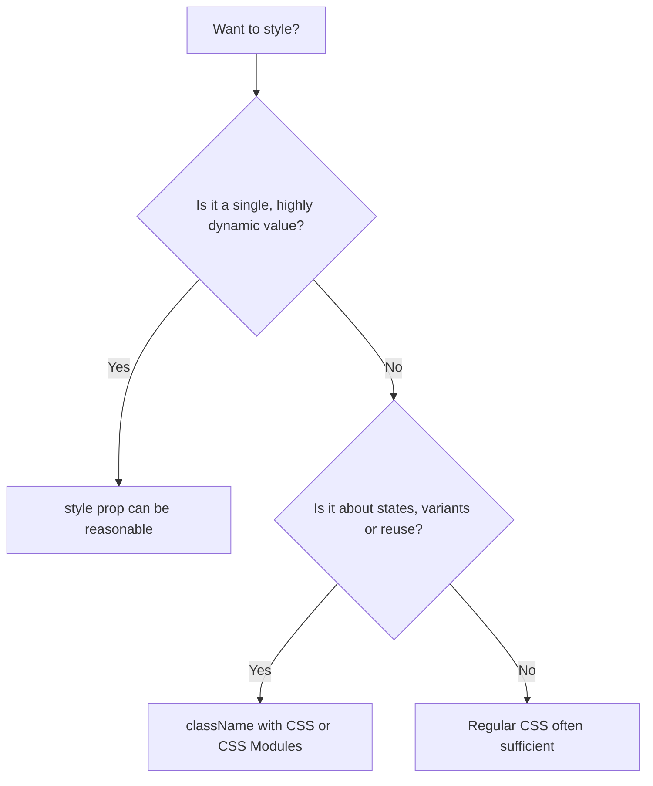
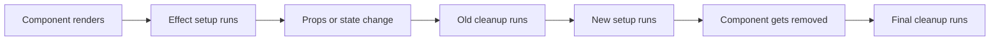
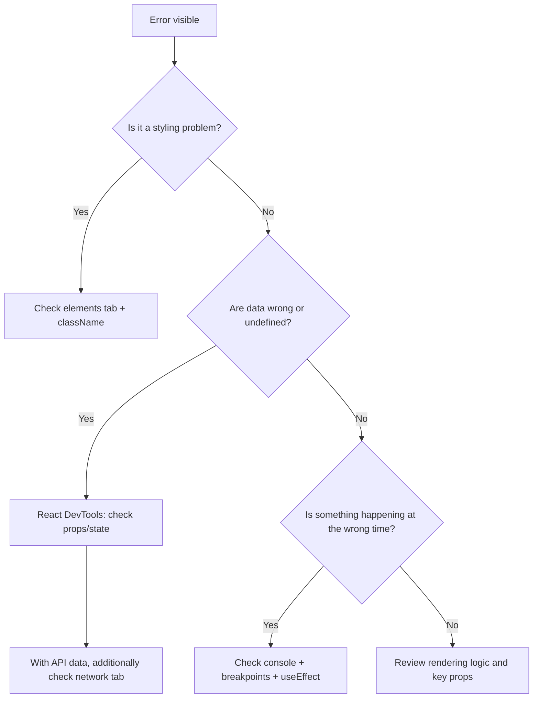

###### Topics

Styling Methods in React

- Using CSS files in React components
- CSS Modules as a structured styling method
- Using conditional className instead of focusing on inline styles

Lifecycle and Side Effects in Functional Components

- What are side effects?
- Simple usage of useEffect
- Cleanup in simple examples (e.g., timer, event listener)

Debugging and Troubleshooting

- React Developer Tools basics
- Typical sources of errors with props, state, and rendering
- Making effective use of console and browser dev tools

# 🎨 Styling Methods in React

In React, you don't strictly separate structure, behavior, and appearance into "HTML, CSS, JavaScript" like in classic websites, but instead by **components**. A component often brings its own markup, its own logic, and its own styling. That's exactly why it's important to understand **how** to style properly in React: with regular CSS files, with CSS Modules, and with sensibly used `className` conditions instead of doing everything via inline styles. React itself supports setting classes via `className` and styles via the `style` prop directly in JSX ([Adding Styles and CSS](https://react.dev/learn/adding-styles-and-css)).

<br><br><br>
## 📄 Using CSS Files in React Components

The simplest styling method is the classic CSS file. For example, you create a file like `Button.css` and import it into your component. In React, this works directly via an import in JavaScript or JSX in typical toolchains like Vite or other build setups ([Adding Styles and CSS](https://react.dev/learn/adding-styles-and-css)).

```jsx
import './Button.css';

export function Button({ children }) {
  return <button className="button">{children}</button>;
}
```

```css
.button {
  background: royalblue;
  color: white;
  border: none;
  padding: 0.75rem 1rem;
  border-radius: 8px;
}
```

Important: **The import does not make the CSS automatically only apply to this component.** Classes in a regular CSS file are generally **global**. So if you write `.button` elsewhere as well, styles can interfere with each other. This is one of the most common reasons why styling becomes confusing in larger React projects.

Nevertheless, regular CSS files are very useful, especially when:

- you need global base styles,
- you want to set a reset or a theme,
- you want to reuse layout classes,
- your project is still small and manageable.

A typical pattern is: **global CSS files for app-wide rules**, but **component-local files for specific UI building blocks**.

<br><br><br>
### 🧩 What the Import Means in Practice

When you import a CSS file into a React component, you are basically telling your build system: "These styles should be included in the bundle." You don't get a **JavaScript variable**; instead, you're ensuring that the CSS rules are present. The linkage to the component then happens via `className`.

React uses `className` instead of `class` in JSX because `class` is a reserved word in JavaScript. That's why you write:

```jsx
<div className="card">Content</div>
```

and not:

```jsx
<div class="card">Content</div>
```

This is the official React way to attach CSS classes to DOM elements ([Adding Styles and CSS](https://react.dev/learn/adding-styles-and-css)).

<br><br><br>
### ⚠️ Typical Problems with Regular CSS Files

With classic CSS files, three problems quickly appear in React projects:

1. **Name collisions**  
   Two files accidentally define the same class, like `.title` or `.button`.

2. **Unclear origin**  
   You see a class in the browser but don't know immediately which CSS file the rule came from.

3. **Unintentional side effects via inheritance and specificity**  
   A global rule like `button { ... }` or `.card button { ... }` suddenly affects components that should actually be independent.

This is a critical issue especially for reusable components. That's why many teams end up using **CSS Modules** after a while.

<br><br><br>
## 🧱 CSS Modules as a Structured Styling Method

CSS Modules are a structured form of CSS in which class names are **locally** bound to a file. The central principle: A class from `Button.module.css` is internally processed so that it doesn't just appear as `.button` globally throughout the project, but gets a uniquely generated name. This significantly reduces collisions ([CSS Modules](https://github.com/css-modules/css-modules)).

In modern React setups like Vite, files with the pattern `.module.css` are treated as CSS Modules ([Features | Vite](https://vite.dev/guide/features.html#css-modules)).

```jsx
import styles from './Button.module.css';

export function Button({ children }) {
  return <button className={styles.button}>{children}</button>;
}
```

```css
.button {
  background: seagreen;
  color: white;
  border: none;
  padding: 0.75rem 1rem;
  border-radius: 8px;
}
```

Here, `styles` is an object. `styles.button` contains **not simply** the text `"button"`, but typically a generated class name like `"Button_button__a1b2c"`. This makes the class local and less prone to conflicts.

<br><br><br>
### 🧠 Why CSS Modules Fit So Well with React

React is strongly component-oriented. CSS Modules are a perfect fit, as they also organize styling **close to files and components**.

This gives you several advantages:

- **Better encapsulation:** Styles of a component remain in its file.
- **Fewer naming issues:** `.button` can exist in several components.
- **Easier maintenance:** When reading the import, you immediately see where classes are coming from.
- **Cleaner scalability:** In medium and large projects, CSS remains much clearer.

One important point: CSS Modules are **not another CSS dialect**. You still write regular CSS. The difference is how the class names are processed and imported.

<br><br><br>
### 🔀 Conditional Classes with CSS Modules

Especially in React, you often want to set different classes based on state: active, inactive, error, success, loaded, disabled. This works very cleanly with CSS Modules.

```jsx
import styles from './Button.module.css';

export function Button({ variant = 'primary', disabled = false, children }) {
  const className = [
    styles.button,
    variant === 'primary' ? styles.primary : styles.secondary,
    disabled ? styles.disabled : ''
  ]
    .filter(Boolean)
    .join(' ');

  return (
    <button className={className} disabled={disabled}>
      {children}
    </button>
  );
}
```

```css
.button {
  padding: 0.75rem 1rem;
  border-radius: 8px;
  border: none;
}

.primary {
  background: royalblue;
  color: white;
}

.secondary {
  background: lightgray;
  color: black;
}

.disabled {
  opacity: 0.5;
  cursor: not-allowed;
}
```

The key point: You continue working with classes, just locally encapsulated. This is much cleaner than building a new inline style object for every state.

<br><br><br>
### 📊 Regular CSS Files vs. CSS Modules

| Aspect | Regular CSS File | CSS Modules |
|---|---|---|
| Scope | Usually global | Local per file |
| Risk of name collisions | Rather high | Much lower |
| Easy to start with | Very easy | Also easy |
| Suitable for global styles | Yes | Not really the main use |
| Good for components | Possible but error-prone | Very good |
| Accessing classes in JSX | `"button"` | `styles.button` |

For a small project, regular CSS files are sufficient. If your project grows or you build lots of reusable components, CSS Modules are usually the more robust solution.

<br><br><br>
## 🏷️ Using Conditional `className` Instead of Focusing on Inline Styles

React also allows inline styles using the `style` prop. There, you pass a JavaScript object instead of a CSS string ([Adding Styles and CSS](https://react.dev/learn/adding-styles-and-css)).

```jsx
<div style={{ color: 'crimson', fontSize: 18 }}>Warning</div>
```

This is handy, but in real applications, you should **not solve everything with inline styles**. For states like `active`, `error`, `selected`, `disabled`, or `open`, conditional classes are almost always more readable and maintainable.

Why? Because CSS is made exactly for such states:

- Classes are easier to combine.
- Hover, focus, and active states are more naturally described in CSS.
- Media queries and responsive rules work more pleasantly in CSS.
- Animations and transitions remain cleaner.
- Styling stays better separated from component logic.

<br><br><br>
### ✅ Good Use of `className` With Conditions

```jsx
export function Alert({ isError, children }) {
  return (
    <div className={isError ? 'alert alert--error' : 'alert alert--success'}>
      {children}
    </div>
  );
}
```

```css
.alert {
  padding: 1rem;
  border-radius: 8px;
}

.alert--error {
  background: #ffe5e5;
  color: #8b0000;
}

.alert--success {
  background: #e7f8ea;
  color: #146c2e;
}
```

There is an important principle here: **The state of your component decides on the classes**, and the classes decide the appearance.

This is especially convenient in React, as JSX and JavaScript work closely together. You can use the ternary operator, `&&`, or built strings for conditions as normal. React itself shows exactly these patterns for conditional rendering and state management ([Conditional Rendering](https://react.dev/learn/conditional-rendering)).

<br><br><br>
### 🚫 Why Too Many Inline Styles Are Often Problematic

Consider this example:

```jsx
export function Alert({ isError, children }) {
  return (
    <div
      style={{
        padding: '1rem',
        borderRadius: '8px',
        background: isError ? '#ffe5e5' : '#e7f8ea',
        color: isError ? '#8b0000' : '#146c2e'
      }}
    >
      {children}
    </div>
  );
}
```

Technically, this works. But as the component grows, this approach becomes more and more unwieldy. You end up mixing:

- Visual rules,
- State logic,
- Often repeated values,
- And eventually responsive special cases.

Inline styles are good for **single dynamic values**, for example:

- a percentage width,
- a dynamic position,
- a CSS variable,
- a dynamic transform value.

Example:

```jsx
<div style={{ width: `${progress}%` }} />
```

Here, inline style makes sense because the value comes directly from logic. For state-driven design such as error, focus, theme variants, or interactions, classes are usually much cleaner.

<br><br><br>
### 🧭 A Sensible Decision Model



The rule of thumb is simple: **Logic determines classes, CSS determines appearance.** Use inline styles only when you really have a direct, individual value from JavaScript.

<br><br><br>
# ♻️ Lifecycle and Side Effects in Functional Components

In functional React components, there are no classic lifecycle methods like `componentDidMount`, `componentDidUpdate`, or `componentWillUnmount` from old class components anymore. Instead, you mainly deal with **rendering** and **effects**. In practice, this is often clearer: first the component describes **what the UI should look like**, and if necessary, an effect synchronizes the component with something outside React ([Synchronizing with Effects](https://react.dev/learn/synchronizing-with-effects)).

<br><br><br>
## ⚙️ What Are Side Effects?

A side effect — called **effect** in React — is anything that happens **outside of pure rendering**. Ideally, React components should be **pure** when rendering: same inputs, same results, with no outside changes ([Keeping Components Pure](https://react.dev/learn/keeping-components-pure)).

A side effect includes, for example:

- a timer,
- an API call,
- registering an event listener,
- changing `document.title`,
- accessing browser APIs,
- connecting to an external system.

The important idea: **Rendering only describes the UI.** Anything that touches or synchronizes with the outside world doesn't belong directly in the render part, but typically into `useEffect` ([useEffect](https://react.dev/reference/react/useEffect)).

<br><br><br>
### 🧠 Why Rendering Should Stay “Pure”

If you execute side effects during rendering, it can lead to strange and hard-to-explain errors. The reason is that React may render components multiple times to correctly compute the UI. If you start timers or register event listeners during rendering, these actions may happen multiple times or at the wrong moment.

This is why the separation is so important:

- **Rendering:** "What does the UI look like?"
- **Effect:** "What has to be synchronized with the outside world?"

This mindset makes functional components more predictable.

<br><br><br>
## 🪝 Simple Usage of `useEffect`

`useEffect` is the hook you use to perform such side effects in functional components. An effect runs **after React has rendered and applied the changes to the UI**; it's for synchronizing your component with an external system ([useEffect](https://react.dev/reference/react/useEffect)).

The basic form looks like this:

```jsx
import { useEffect } from 'react';

useEffect(() => {
  // Side effect
}, []);
```

The function you pass to `useEffect` is often called the **setup function**. It contains the action to perform.

<br><br><br>
### 📌 The Meaning of the Dependency Array

The second argument to `useEffect` is the so-called dependency array. It determines **when** the effect should rerun.

| Syntax | Meaning |
|---|---|
| `useEffect(() => { ... })` | Runs after every render |
| `useEffect(() => { ... }, [])` | Runs once after the first mount |
| `useEffect(() => { ... }, [count])` | Runs on first mount and every time `count` changes |

This is crucial, as many beginner mistakes are caused exactly here. For example, if you set state in an effect and that effect runs after every render, an endless loop can quickly occur.

<br><br><br>
### 📝 Simple Example: Updating Document Title

```jsx
import { useEffect, useState } from 'react';

export function Counter() {
  const [count, setCount] = useState(0);

  useEffect(() => {
    document.title = `Count: ${count}`;
  }, [count]);

  return (
    <button onClick={() => setCount(count + 1)}>
      Clicks: {count}
    </button>
  );
}
```

Here’s what happens:

1. The component renders.
2. React shows the button.
3. Then the effect runs.
4. The browser tab’s title is set to the current counter value.
5. Every time `count` changes, the effect runs again.

This is a classic, simple side effect: The React component synchronizes a value with the browser environment.

<br><br><br>
### 🔁 Important Note About React in Development Mode

In React's development mode, with `StrictMode` enabled, an effect may deliberately run more often so that bad setups and missing cleanups become apparent. This is not a bug but an intended feature for development ([Synchronizing with Effects](https://react.dev/learn/synchronizing-with-effects)).

So if you think, "Why is my effect running twice?", this is often not due to React 19 itself but the development behavior of `StrictMode`. This is especially noticeable with timers and event listeners — which is exactly why clean cleanup is so important.

<br><br><br>
## 🧹 Cleanup in Simple Examples

Many effects set up something that later needs to be **cleaned up**. That's exactly what the cleanup function in `useEffect` is for. This cleanup function runs before the effect runs again, and also when the component unmounts ([useEffect](https://react.dev/reference/react/useEffect)).

The basic form:

```jsx
useEffect(() => {
  // Setup

  return () => {
    // Cleanup
  };
}, []);
```

The cleanup prevents old timers from continuing to run, event listeners from being doubly registered, or connections from staying open unnecessarily.

<br><br><br>
### ⏱️ Example: Timer with `setInterval` and `clearInterval`

```jsx
import { useEffect, useState } from 'react';

export function Clock() {
  const [seconds, setSeconds] = useState(0);

  useEffect(() => {
    const id = setInterval(() => {
      setSeconds((prev) => prev + 1);
    }, 1000);

    return () => {
      clearInterval(id);
    };
  }, []);

  return <p>Elapsed seconds: {seconds}</p>;
}
```

`setInterval` starts a repeating timer, and `clearInterval` stops it again. This is exactly how these browser functions are meant to be used ([Window: setInterval() method](https://developer.mozilla.org/en-US/docs/Web/API/Window/setInterval), [Window: clearInterval() method](https://developer.mozilla.org/en-US/docs/Web/API/Window/clearInterval)).

Why is the cleanup so important here?

When the component disappears, the timer should not keep running. Without cleanup, the old timer would remain active in the background. In development environments with `StrictMode`, you might even notice double timers if you don't clean up properly.

Note also the syntax here:

```jsx
setSeconds((prev) => prev + 1);
```

This is the functional form of state updating. It's appropriate here because the new value depends on the old one. React recommends this pattern for exactly such cases ([State: A Component's Memory](https://react.dev/learn/state-a-components-memory)).

<br><br><br>
### 🖱️ Example: Event Listener for Window Size

```jsx
import { useEffect, useState } from 'react';

export function WindowWidth() {
  const [width, setWidth] = useState(window.innerWidth);

  useEffect(() => {
    function handleResize() {
      setWidth(window.innerWidth);
    }

    window.addEventListener('resize', handleResize);

    return () => {
      window.removeEventListener('resize', handleResize);
    };
  }, []);

  return <p>Window width: {width}px</p>;
}
```

Here, you register a listener for the window’s `resize` event on mount. When the component unmounts, you remove the same listener again. This is the correct use of the browser APIs `addEventListener` and `removeEventListener` ([EventTarget: addEventListener() method](https://developer.mozilla.org/en-US/docs/Web/API/EventTarget/addEventListener), [EventTarget: removeEventListener() method](https://developer.mozilla.org/en-US/docs/Web/API/EventTarget/removeEventListener)).

Without cleanup, several problems may occur:

- The same listener is registered multiple times,
- Unnecessary work remains running in the background,
- Old components still respond to events even though they're no longer visible.

<br><br><br>
### 🔄 How an Effect with Cleanup Really Works



This model helps greatly for understanding. An effect is not simply "run code once", but more like:

1. Start setup,
2. On change, resync cleanly,
3. At the end, clean up.

This is the core of lifecycle thinking in functional components.

<br><br><br>
### ⚠️ Common Rookie Mistakes with Effects

Here are some typical mistakes to watch out for:

**Using an effect unnecessarily**  
Not everything needs `useEffect`. If you can calculate a value directly from props or state, do so in the render. React recommends avoiding unnecessary effects ([Synchronizing with Effects](https://react.dev/learn/synchronizing-with-effects)).

**Setting state in an effect and creating loops**  
If an effect runs on every render and sets state each time, you can easily create an infinite loop.

**Forgetting cleanup**  
Especially with timers, subscriptions, and event listeners, this often leads to double executions or hard-to-detect bugs.

**Specifying dependencies incorrectly**  
If an effect uses a value that's not in the dependencies list, you may work with outdated values.

<br><br><br>
# 🐞 Troubleshooting and Debugging

Debugging in React is not only about "finding" errors but about understanding **where** they arise: in props, in state, during a render, in an effect, or in a browser API. Good debugging is thus a mix of React tools, browser dev tools, and a clear mindset about data flow.

<br><br><br>
## 🧰 React Developer Tools Basics

React Developer Tools is the most important specialized extension for React in the browser. It lets you inspect your app's component structure, view props and state, and see which component currently holds which value ([React Developer Tools](https://react.dev/learn/react-developer-tools)).

There are two especially important areas:

- **Components**
- **Profiler**

<br><br><br>
### 🧱 The Components Tab

In the Components tab, you see the React component tree — not just the pure DOM elements like `div` or `button`, but the actual React components like `App`, `ProductList`, `Button`, or `Modal`.

This helps you with questions like:

- Which component is rendering?
- What props does it receive?
- What state does it currently have?
- Which hooks are being used?

If a component displays incorrect data, the Components tab is often the quickest way to check if the error is already **in the props** or arises **inside the component**.

Example: If `UserCard` suddenly shows `undefined` instead of "Anna", you can check directly if `name` is arriving as a prop. React explains the props data flow exactly as passing from parent to child components ([Passing Props to a Component](https://react.dev/learn/passing-props-to-a-component)).

<br><br><br>
### 📈 The Profiler

The Profiler is for performance questions. It shows you which components rendered when and how long these render passes took. For beginners, this isn't the first tool, but it quickly becomes important if you want to understand why your app stutters on input or certain areas rerender unnecessarily often.

For basics, this is enough:  
The Components tab helps with **content**, the Profiler with **behavior and timing**.

<br><br><br>
### 🔍 What to Use React DevTools for in Practice

Very often, you can answer three core questions with React DevTools:

1. **Are the props correct?**
2. **Is the state correct?**
3. **Is the right component even rendering with the expected data?**

If you systematically check these three, you'll solve a large share of typical React problems.

<br><br><br>
## ⚠️ Typical Sources of Error with Props, State, and Rendering

Many React errors first seem complicated but are often simple data flow issues. You should be able to clearly distinguish the important ones.

<br><br><br>
### 📦 Errors with Props

Props are a component's inputs. Common problems include:

- Wrong prop name,
- Missing prop,
- Wrong data type,
- Wrong structure in objects or arrays.

Example:

```jsx
function UserCard({ name }) {
  return <h2>{name}</h2>;
}

<UserCard titel="Anna" />
```

Here, `titel` is passed but `name` is expected. The result is `undefined`. The component itself isn't broken — the data just comes through under the wrong name. You can quickly spot such cases with React DevTools.

Another classic is destructuring nested data, even though the data isn't there yet:

```jsx
function UserCard({ user }) {
  return <h2>{user.name}</h2>;
}
```

If `user` is still `undefined`, you'll get an error. You either need to safeguard in advance or ensure the data arrives on time.

<br><br><br>
### 🧠 Errors with State

State is changeable component state. A common error is to **mutate state directly** instead of setting a new value. React expects new values on state updates, especially with objects and arrays ([Updating Objects in State](https://react.dev/learn/updating-objects-in-state), [Updating Arrays in State](https://react.dev/learn/updating-arrays-in-state)).

Bad:

```jsx
user.name = 'Anna';
setUser(user);
```

Better:

```jsx
setUser({ ...user, name: 'Anna' });
```

Why is this important? In practice, React detects changes better if you produce new references. Direct mutation often leads you to think, "I changed the value," but the UI doesn't react as expected.

Another frequent error is state updates that depend on the old state but are not written functionally:

```jsx
setCount(count + 1);
setCount(count + 1);
```

This doesn't necessarily increment by 2. Better is:

```jsx
setCount((prev) => prev + 1);
setCount((prev) => prev + 1);
```

So each update uses the previous, truly current value ([State: A Component's Memory](https://react.dev/learn/state-a-components-memory)).

<br><br><br>
### 🖼️ Errors in Rendering

Rendering errors often don't arise in state itself but in how JSX is generated from it.

A very common case is lists without stable `key` props. React uses `key` to correctly associate list items between renders ([Rendering Lists](https://react.dev/learn/rendering-lists)).

```jsx
{users.map((user) => (
  <li key={user.id}>{user.name}</li>
))}
```

Without a sensible `key`, React may reuse elements incorrectly. Then you see strange outcomes like:

- Wrong contents in list elements,
- Lost input values,
- Unexpected jumps when updating.

Another rendering error is triggering a state update directly in rendering:

```jsx
function Counter() {
  const [count, setCount] = useState(0);

  setCount(count + 1);

  return <p>{count}</p>;
}
```

This creates a render loop: render, update state, render again, update state again. State updates belong in event handlers or effects, not directly in the body of the render.

<br><br><br>
### 📊 Typical Error Patterns at a Glance

| Symptom | Likely Cause | Typical Fix |
|---|---|---|
| `undefined` in UI | Wrong or missing prop | Check prop names and passing |
| UI doesn’t update | State mutated instead of replaced | Create new object/array |
| Component keeps rerendering | State update in render or effect loop | Check what triggers the update |
| List behaves strangely | Missing or poor `key` | Set stable, unique `key` |
| Event fires multiple times | Listener or timer not cleaned up | Add cleanup in `useEffect` |
| Old value is used | Stale closure or wrong dependencies | Use functional update / check dependencies |

Tables like these may seem simple but are invaluable in practice: Don't just look at the error, always check for the **pattern behind** it.

<br><br><br>
## 🖥️ Making Effective Use of Console and Browser DevTools

Many developers underestimate the power of the normal browser console and dev tools. In React, you don't always need a special tool. Often, a smart combo of `console`, elements tab, network tab, and debugger does the trick.

<br><br><br>
### 🪵 Using Console Wisely Instead of Chaotically

`console.log()` is the standard, but not always the best tool. The console offers several handy methods for structured data output ([Console](https://developer.mozilla.org/en-US/docs/Web/API/Console)).

For example:

```jsx
console.log('props', props);
console.table(users);
console.error('Error loading', error);
```

`console.table()` is especially handy for arrays of objects because you immediately see the data in a table. This is much more readable for lists, API results, or state snapshots than a plain log.

Important: Use console with a plan. Don't just log randomly; ask concrete questions:

- Is the prop arriving at all?
- What is the value of the state **before** the click?
- What is it **after** the click?
- Is the event handler triggered?
- Does an effect run more often than expected?

This way, the console becomes a diagnostic rather than a noise tool.

<br><br><br>
### 🧪 Good Places for `console.log`

Some good locations:

**In the event handler**
```jsx
function handleClick() {
  console.log('Before update:', count);
  setCount((prev) => prev + 1);
}
```

**In the effect**
```jsx
useEffect(() => {
  console.log('Effect runs with count =', count);
}, [count]);
```

**Before the return of a component**
```jsx
console.log('UserCard renders with', user);
return <div>{user.name}</div>;
```

This helps you distinguish:

- Is the component actually being rerendered?
- Is a handler really triggered?
- Is the value already wrong in render or only later?

This timing distinction is essential for debugging.

<br><br><br>
### 🧭 Elements Tab: Seeing What Actually Arrives in the DOM

The elements tab of the browser dev tools displays the **real DOM** and the final applied CSS rules. This is especially important for styling issues.

If a button looks wrong, you can check:

- Which classes were actually applied?
- Was the expected class even rendered?
- Which CSS rule wins out?
- Is a style being overridden?
- Is a global rule perhaps stronger than expected?

This is especially helpful with regular CSS files and CSS Modules. With CSS Modules, you’ll see the generated class name in the DOM, but you can still track exactly which rule is active.

<br><br><br>
### 🌐 Network Tab: Indispensable for Data Issues

If data comes from an API, the error is often not a React error at all. Then you should check the network tab:

- Was the request even sent?
- Is a response returned?
- What status code was received?
- Does the response actually contain the expected data?

Many supposed "state problems" are actually:

- A 404 or 500,
- A wrong endpoint,
- An empty response,
- A different JSON structure than expected.

So before searching JSX for long, always first check the network tab for data errors.

<br><br><br>
### 🛑 Breakpoints and `debugger` Instead of Only Logs

Logs are good, but sometimes you want to **pause** the code and inspect calmly. That's what breakpoints in the browser dev tools or the `debugger` statement are for. JavaScript supports `debugger` natively ([debugger](https://developer.mozilla.org/en-US/docs/Web/JavaScript/Reference/Statements/debugger)).

```jsx
function handleSubmit(data) {
  debugger;
  console.log(data);
}
```

As soon as this code runs and the dev tools are open, the browser pauses here. Then you can:

- Inspect variables,
- Step through the code,
- Check the call stack,
- See how you got to this point.

This is often much more powerful than ten additional `console.log()` lines.

<br><br><br>
### 🧩 A Sensible Debugging Workflow in React



This workflow is so useful because it keeps you from searching haphazardly everywhere at once.

<br><br><br>
### 🧠 Practical Debugging Mindset

The most important habit in React is:

**Trace the data path.**

Always ask yourself in this order:

1. Where do the data come from?
2. Do they arrive as props?
3. Are they stored correctly in state?
4. Are they used correctly in render?
5. Does some effect or event handler change something unexpectedly?

If you work like this, even complicated bugs become much more tangible. React is rarely "magically broken" — usually, some part of the data flow is interrupted, outdated, or misnamed.